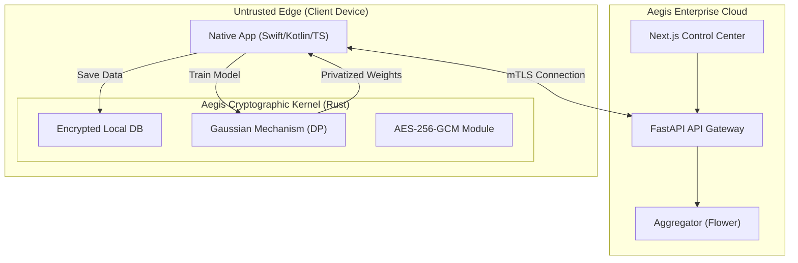

<div align="center">


# 🛡️ AEGIS

**The Privacy-Preserving AI Infrastructure for the Enterprise.**  
*Next-Generation Data Protection, Federated Learning, and Cryptographic Isolation.*

[](https://opensource.org/licenses/MIT)
[](https://www.rust-lang.org/)
[](https://www.python.org/)
[](https://nextjs.org/)
[](docs/ENCRYPTION.md)

[Read the Docs](#) · [View Live Demo](#) · [Report Bug](#) · [Request Feature](#)

</div>

---

**Aegis** is an enterprise-grade, zero-trust infrastructure engineered to enable **Federated Learning (FL)** and secure data storage on untrusted networks. It bridges the gap between high-level AI research, stunning user experiences, and military-grade verified cryptography.

## 🚀 Why Aegis?

Traditional centralized AI models demand that raw user data be aggregated in the cloud, exposing organizations to massive regulatory risk. Aegis flips the paradigm by training models entirely on the edge, orchestrated by a highly secure Rust kernel.

| Feature | Traditional AI Cloud | 🛡️ The Aegis Platform |
| :--- | :--- | :--- |
| **Data Residency** | Centralized Cloud | **Stays on User Device (Local)** |
| **Encryption** | File-level (Slow) | **Stream-based Chunks (Instant AES-256-GCM)** |
| **Privacy Math** | Basic Anonymization | **Verified Rust Differential Privacy (DP-SGD)** |
| **User Experience** | Clunky Internal Tools | **Premium Next.js Dashboard & 3D Analytics** |
| **Compliance** | Months of Audits | **Turnkey HIPAA, GDPR, UAE PDPL, & DPDPA** |

---

## 🌟 Platform Ecosystem

Aegis is a cohesive monorepo composed of three elite tiers:

### 1. 🔒 The Secure Vault Engine (`aegis-engine`)
*Forged in **Rust** for uncompromising memory safety.*
* **Streaming Encryption:** Encrypts multi-gigabyte datasets with constant $O(1)$ RAM usage.
* **Crypto-Shredding:** Secure key destruction makes localized data mathematically irrecoverable.
* **Cross-Platform:** Native compilations for iOS (Swift), Android (Kotlin), and Desktop.

### 2. 🧠 Distributed AI Coordination (`aegis-core`, `server`, `gateway`)
*Built in **Python** & **FastAPI** for deep learning flexibility.*
* **Federated Orchestration:** Powered by custom Flower (`flwr`) strategies limiting privacy budgets.
* **Resilient State:** Fully fault-tolerant architecture with active checkpointing.
* **Zero-Knowledge API:** The Gateway routes model weights without ever inspecting the payload.

### 3. ✨ Enterprise Command Center (Next.js Frontend)
*Crafted with **React**, **Tailwind CSS**, and **Framer Motion**.*
* **POC Automation:** Deploy isolated prospect environments in a single click.
* **Interactive Threat Modeling:** Real-time 3D webGL graphics (Spline) visualizing active fleet health.
* **Compliance Dashboard:** Unified monitoring of API quotas, risk scores, and granular RBAC.

---

## 🏗 Architecture Topology



---

## ⚡ Getting Started

### Prerequisites
* **Rust**: `1.75+`
* **Python**: `3.10+`
* **Node.js**: `18+`

### 1. Initialize the Core API & Engine
```bash
# Clone the repository
git clone https://github.com/Lingikaushikreddy/Aegis.git
cd Aegis

# Build the Rust Kernel (High-Performance TEE limits)
cd aegis-engine && cargo build --release && cd ..

# Install Python requirements & launch Gateway
pip install -r requirements.txt
python3 -m aegis_gateway.app
```

### 2. Launch the Fleet Command (Frontend UI)
```bash
# Install Node dependencies
npm install

# Start the Next.js development server
npm run dev
```
Navigate to `http://localhost:3000` to access the admin portal.

---

## 🛡️ Pre-Launch Security Audit
**Status: PASSED**
The Aegis platform undergoes rigorous multi-layer testing:
- **Rust Core:** 84/84 hardware encryption tests passing.
- **Python Backend:** Bandit static code analysis validated.
- **TypeScript:** Strict `eslint` validation with optimal accessibility standards.

---

## 🤝 Contributing

We welcome contributors who share our vision of privacy-preserving AI.
1. Read the `docs/ARCHITECTURE.md` to understand our threat model.
2. Ensure you pass `cargo clippy`, `pytest`, and `npm run lint` before opening a Pull Request.
3. For security vulnerabilities, **do not open a public issue**. Please follow our security advisory protocol.

## 📄 License
Licensed under **MIT**. See `LICENSE` for details.

---
<div align="center">
  <i>Defending data. Empowering models.</i><br>
  <b>Built with ❤️ by the Aegis Team.</b>
</div>
